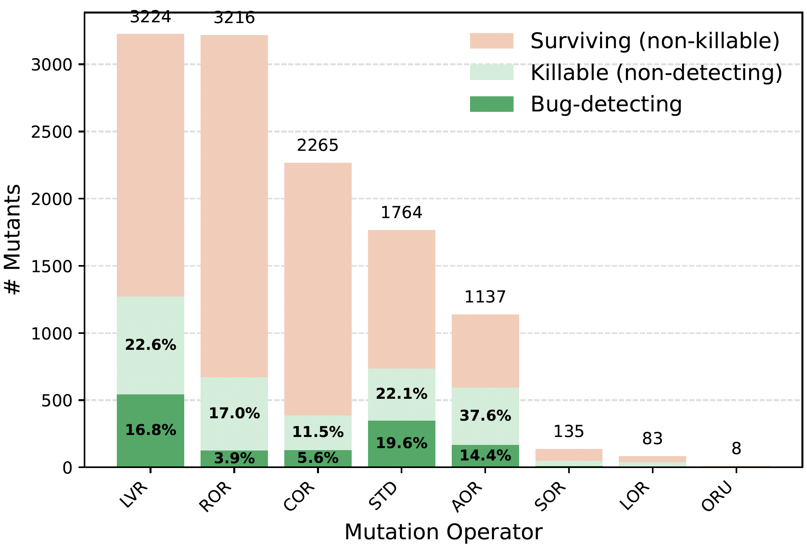

# 📄 Artifact Documentation

This repository contains the artifact accompanying our paper, **accepted at ISSTA 2026** 🎉
Our artifact extends **Defects4J version 3.0.1**  https://github.com/rjust/defects4j/tree/v3.0.1
Which contains the necessary code to generate fault-revealing augmentations from real bugs and surviving mutants.

[](https://github.com/spideruci/Defects4j_for_Coupling_Effect_Analysis_Through_Killing_Surviving_Mutants/actions/workflows/ci.yml)
[](https://github.com/spideruci/Defects4j_for_Coupling_Effect_Analysis_Through_Killing_Surviving_Mutants/actions/workflows/docker.yml)
[](https://doi.org/10.5281/zenodo.21013232)

The environment, smoke tests, and the full assertion-generation pipeline are continuously
exercised on GitHub Actions, and a ready-to-run Docker image is published to GHCR — see
[Continuous Integration](#continuous-integration) and [Run with Docker](#run-with-docker).


## Table of Contents

- [Artifact Description and PDF Documentation](#artifact-description-and-pdf-documentation)
- [Table of Real Bugs Detectable Through Assertion Augmentation](#table-of-real-bugs-detectble-through-assertion-augmentation)
- [Code](#code)
  - [How to Get Started](#how-to-get-started)
    - [Run with Docker](#run-with-docker)
  - [Continuous Integration](#continuous-integration)
  - [Source Code](#source-code)
- [Generated Assertions](#generated-assertions)

- [Experimental Cost](#experimental-cost)

- [Analysis on Mutation Operators](#analysis-on-mutation-operators)


# Artifact Description and PDF Documentation

This repository contains the multifaceted artifacts associated with our paper, including both the dataset and the supporting code.
The contents of this repository are briefly introduced in this README.
Detailed information—such as the experimental setup and the new commands we added to Defects4J to support our analysis—is provided in the accompanying documentation.


👉 [Open Artifact Documentation (doc.pdf)](doc.pdf)

# Table of Real Bugs Detectble Through Assertion Augmentation

This table lists all 104 program versions and bug IDs for which we successfully generate test assertions in originally passing covering tests, enabling them to detect the corresponding real bugs as triggering tests.
For these program versions, we perform mutation analysis and targeted mutant-killing activities.


| Subject | Bug IDs |
|--------|--------|
| Cli | 1, 2, 4, 10, 16, 21, 22, 26, 31, 34, 36 |
| Math | 6, 13, 14, 23, 24, 33, 44, 57, 58, 62, 64, 66, 68, 74, 76, 81, 84 |
| Jsoup | 3, 25, 31, 32, 50, 56, 62, 63, 72, 76, 77, 87 |
| Lang | 6, 32, 56 |
| Csv | 10, 16 |
| Chart | 1, 3, 7, 8, 16, 20 |
| Codec | 4, 14, 16 |
| Collections | 17, 21 |
| Gson | 2, 3, 8 |
| JacksonCore | 2, 3, 10, 12, 15, 16, 22, 26 |
| JacksonXml | 2 |
| JxPath | 4 |
| Compress | 2, 3, 4, 9, 22, 25, 34, 35, 39 |
| Time | 1, 2, 6, 19, 22, 23 |
| JacksonDatabind | 2, 11, 12, 18, 22, 23, 24, 30, 31, 37, 44, 53, 59, 63, 78, 87, 92, 103, 111, 112 |


# Code
The analysis and full experimental pipeline are implemented and streamlined through tight integration with Defects4J.  
To support our analysis, we introduce **nine new Defects4J commands**, several of which are useful beyond this study.  
For example, the command `defects4j patch [-b|-f]` switches the current program version between the buggy and fixed variants.  
All nine commands, along with their intended workflows and usage examples, are described on pages 4–9 of the accompanying documentation ([doc.pdf](doc.pdf)).

## How to Get Started

Our implementation supports experiments on **Mac mini (M4)**, **MacBook Pro (2021, Apple M1 Pro)**, and **Linux x86_64 systems** equipped with an **Intel Core i7-950 CPU** (4 cores / 8 threads, 3.07 GHz).  
We therefore expect the implementation to run on most **macOS** and **Linux-based** machines.

The first section of the accompanying documentation ([doc.pdf](doc.pdf)) describes how to set up the environment, install dependencies, and run the full analysis for a given program version.  
In particular, pages 2–3 list the required dependencies and their versions for configuring Defects4J.

Pages 3–4 provide a step-by-step example demonstrating how to run the experiment for **Cli-2**, which takes approximately **13 minutes** on a **MacBook Pro (2021, M1 Pro)**.

### Run with Docker

A self-contained image is provided so the Cli-2 example can be run without installing the
toolchain (Java 11, Subversion, Perl/CPAN, Python 3, jq) by hand. It is built for `linux/amd64`
(runs natively on x86-64; on Apple Silicon it runs automatically via Docker's emulation).

**Option A — download the prebuilt image (no build).** The image is archived on Zenodo
(DOI [10.5281/zenodo.21013232](https://doi.org/10.5281/zenodo.21013232)) as
`coupling-effect-cli2.tar.gz` (~2.3 GB). Download that file from the Zenodo record, then:

```bash
docker load -i coupling-effect-cli2.tar.gz     # restores image: coupling-effect:cli-2
docker run --rm coupling-effect:cli-2          # runs the Cli-2 example and validates outputs
```

**Option B — build it yourself** (downloads dependencies during the build; ~20–40 min):

```bash
docker build -t coupling-effect:cli-2 .
docker run --rm coupling-effect:cli-2
```

**More usage:**

```bash
# Run any other curated bug (must have a coverages/<Project>_<Version> file).
# Name the entrypoint script explicitly so the arguments are passed to it:
docker run --rm coupling-effect:cli-2 run-example.sh Lang 11b

# Drop into an interactive shell
docker run --rm -it coupling-effect:cli-2 bash
```

The container prints a per-check summary (bug-revealing assertions, validated mutant-derived
assertions, and mutant-derived assertions that detect the real bug) and exits non-zero if any
check fails.

> **Note on scope and cost.** The Docker image demonstrates the pipeline on individual program
> versions (e.g., Cli-2, Lang-11b); it does **not** re-run the entire study, and we did not
> systematically re-execute all bugs inside the container — the full methodology and per-version
> results are documented in [`doc.pdf`](doc.pdf). As reported in the paper, the experiment was
> conducted on a **Mac mini (Apple M4)**, a **MacBook Pro (2021, Apple M1 Pro)**, and a
> **Linux x86_64** machine (Intel Core i7-950, 4 cores / 8 threads, 3.07 GHz). It is inherently
> expensive: as noted on **page 11** of the paper, the full experiment took nearly **two months**
> to complete, owing to the intrinsic cost of mutation testing (repeated compilation, test
> execution, and per-mutant analysis).

## Continuous Integration

Two GitHub Actions workflows (under [`.github/workflows`](.github/workflows)) keep the
artifact reproducible and exercise the pipeline on every push and pull request to `master`.

### `CI (Java11 + Maven + Defects4J)` — [`ci.yml`](.github/workflows/ci.yml)

Provisions the environment from scratch (Java 11, Subversion ≥ 1.8, Perl/CPAN modules,
Python 3, `jq`), runs `init.sh`, puts `framework/bin` on `PATH`, and then:

1. **Defects4J + custom-command smoke test** — checks out **Cli-2b**, compiles it, runs
   the test suite, and exercises the custom `defects4j patch -f / -b` command to confirm
   the buggy ⇄ fixed switching added by this artifact works.
2. **Assertion-generation pipeline + output validation** — runs the documented
   `defects4j get_project Cli 2b` → `full_state_analysis.sh` flow end-to-end and asserts
   the generated outputs:
   - `test_outcome.json` has ≥ 1 `accept` — a real-bug-derived, bug-revealing assertion;
   - `test_outcome_mutants.json` has ≥ 1 `accept` — a validated mutant-derived assertion;
   - `detect_real_bugs.json` has ≥ 1 `killing` — a mutant-derived assertion that detects the real bug.

   For Cli-2 this currently yields **12** bug-revealing, **9** validated mutant-derived,
   and **9** real-bug-detecting assertions.

### `Docker image` — [`docker.yml`](.github/workflows/docker.yml)

Builds the image described in [Run with Docker](#run-with-docker), runs a lightweight
smoke test (`defects4j` is on `PATH` and the custom commands resolve), and on `master`
publishes the image to the GitHub Container Registry (GHCR).

## Source Code
The Defects4J customizations introduced in this work are implemented directly in this repository.  
The main additions and modifications to Defects4J commands are located under `framework/bin`.

Coverage information for each bug is precomputed and stored in the `coverages` directory.  
In addition, several utility directories are used throughout the experiments, including
`mutation_testing_utils`, `mutation_testing_utils_shaded`, and `state_utils`.

The JAR file `state_utils/folder_utils/transform.jar` is used to generate concrete assertion
code from assertion specifications, as introduced in Section 4 of the accompanying documentation
([doc.pdf](doc.pdf)).  
The corresponding source code is provided in the `SourceCodeInstrumentation` directory.

The JAR file `state_utils/folder_utils/o.jar` is used to instrument test code in order to observe
program states.  
The source-code implementation for this functionality is included in the
`observerForSpecification` directory.
## Output of the Analysis

For each program version, the analysis produces a set of structured outputs.
These outputs are organized by analysis stage and stored under the corresponding
program-version directory.

### Overview of Output Artifacts

| Category | File / Directory | Description |
|--------|------------------|-------------|
| General | `time.json` | Execution time for each stage of the analysis |
| Mutation Analysis | `bin/` | Compiled mutant class files used to replace original class files during mutation analysis |
| Mutation Analysis | `full_mutation_analysis.json` | Mutation score and lists of killed and surviving mutant IDs |
| Mutation Analysis | `surviving.json` | Relevant surviving mutants selected for targeted mutant killing |
| Mutation Analysis | `mutant_coverage.json` | Mapping between tests and the mutants they cover |
| Mutation Analysis | `mutants.log` | Mutation metadata indexed by mutant ID |
| Mutation Analysis | `default.mml` | List of source files subjected to mutation (located at the end of the file) |
| Real-bug Assertions | `oracles_specification/` | Assertion specifications derived from real bugs |
| Real-bug Assertions | `oracles/` | Generated Java test files containing real-bug–derived assertions |
| Real-bug Assertions | `test_outcome.json` | Validation results; entries marked as `accept` detect the real bug |
| Real-bug Assertions | `all_states/` | Program state information used to derive real-bug assertions |
| Mutant Assertions | `mutant_oracle_specification/` | Assertion specifications derived from mutants |
| Mutant Assertions | `oracles_mutants/` | Generated Java test files containing mutant-derived assertions |
| Mutant Assertions | `test_outcome_mutants.json` | Validation results; entries marked as `accept` kill the corresponding mutants |
| Mutant Assertions | `detect_real_bugs.json` | Mutant-derived assertions that also detect real bugs (marked as `killing`) |


# Generated Assertions

The assertions generated from both real bugs and mutants are collected in the `data` directory.
They are organized by subject and program version.

Assertions derived from real bugs are stored in the `validated_real_bug_derived_assertions` directory,
with the corresponding specifications located in
`validated_real_bug_derived_assertion_specifications`.

Similarly, assertions derived from mutants are stored in the
`validated_mutant_derived_assertions` directory, with their specifications located in
`validated_mutant_derived_assertion_specifications`.
For mutant-derived assertions, file names indicate whether the assertion is able to detect the real bug.

For example,
`data/Cli/Cli_2b/validated_mutant_derived_assertions/5_assertion_detect_bug.java`
is an assertion generated from surviving mutants for **Cli-2b**.
This mutant-derived assertion is capable of detecting the corresponding real bug.


Specifically, all generated assertions follow the form org.helper.Assertions.verify(...).
The corresponding test method names and test source files in which these assertions are inserted are recorded in the assertion specifications.


# Experimental Cost

We recorded the runtime of each stage of our experiment for every real bug.  
The detailed timing results are reported in `data/time.json`.

Due to huge computational cost and limited resources, all experiments were conducted across three machines:
- **Mac mini (Apple M4)**
- **MacBook Pro (2021, Apple M1 Pro)**
- **Linux x86_64 system** with an Intel Core i7-950 CPU (4 cores / 8 threads, 3.07 GHz)

For each real bug, we report the execution time of four stages:
1. **Bug analysis (`bug_analysis`)**:  
   Analyzing real bugs and generating assertions based on real bugs, including validating each generated assertion individually.
2. **Mutation analysis (`mutation_analysis`)**:  
   Running mutation analysis and identifying surviving mutants.
3. **Surviving mutant analysis (`surviving_mutant_analysis`)**:  
   Analyzing each surviving mutant and generating validated assertions to kill the mutant.
4. **Real-bug detection (`detect real bugs`)**:  
   Validating whether the generated assertions can detect real bugs.


# Analysis on Mutation Operators





We also analyze how mutation operators contribute to real-bug detection. The figure summarizes, for each operator, the participation of its surviving mutants in the mutation-based improvement pipeline.

Each stacked bar shows the relevant surviving mutants produced by an operator, partitioned into non-killable mutants, killable but non-detecting mutants, and killable mutants whose assertions can detect real bugs; percentages are normalized per operator.

For example, the `LVR` operator produces 3,224 relevant surviving mutants, of which 22.6\% are killable but with no augmentations detecting real bugs and 16.8\% yield bug-detecting assertions, meaning roughly 40\% of killable `LVR` mutants can contribute to real-bug detection.

Overall, mutation operators contribute unevenly to real-bug detection.
Operators such as `LVR` (Local Variable Replacement) and `STD`(Statement Deletion) produce high proportions of killable surviving mutants (39.4\% and 41.7\%, respectively), and a substantial fraction of these are coupled to real bugs and yield real-bug-detecting assertions (42\% for `LVR` and 47\% for `STD`).
In contrast, other operators exhibit lower killability or lower chances to produce coupled mutants.